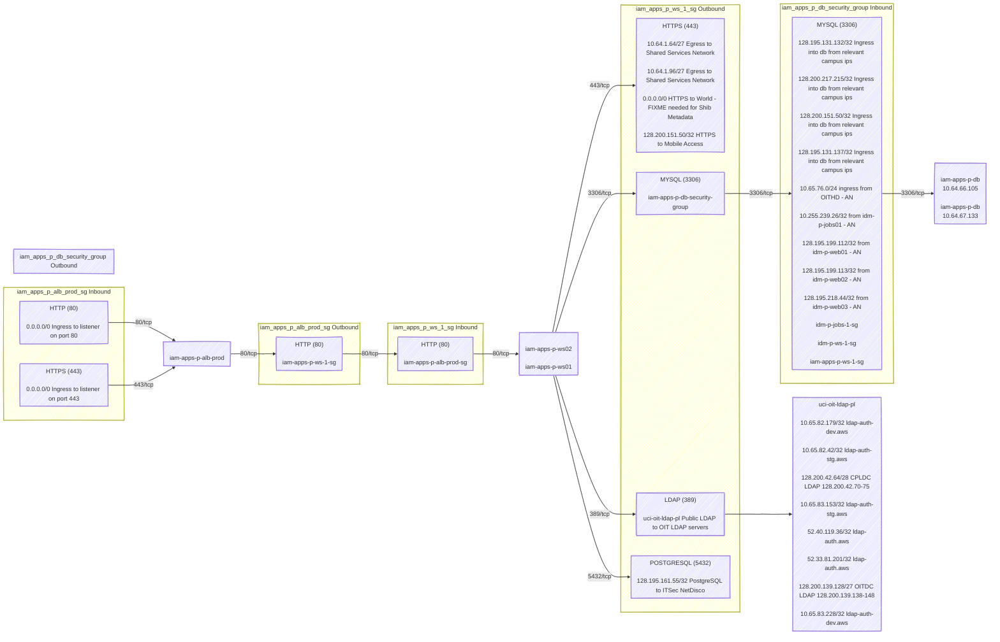

```mermaid
info
```

```mermaid
---
config:
  layout: dagre
  look: handDrawn
---

graph LR
  subgraph iam_apps_p_alb_prod_sg_inbound_rules["iam_apps_p_alb_prod_sg Inbound"]
    subgraph iam_apps_p_alb_prod_sg_tcp_80_inbound["HTTP (80)
      \n0.0.0.0/0&nbsp;Ingress to listener on port 80
    "]
    end
    subgraph iam_apps_p_alb_prod_sg_tcp_443_inbound["HTTPS (443)
      \n0.0.0.0/0&nbsp;Ingress to listener on port 443
    "]
    end
  end
  iam_apps_p_alb_prod_sg_tcp_80_inbound -->|80/tcp| attached_resources_iam_apps_p_alb_prod_sg
  iam_apps_p_alb_prod_sg_tcp_443_inbound -->|443/tcp| attached_resources_iam_apps_p_alb_prod_sg
  subgraph iam_apps_p_alb_prod_sg_outbound_rules["iam_apps_p_alb_prod_sg Outbound"]
    subgraph iam_apps_p_alb_prod_sg_tcp_80_outbound["HTTP (80)
      \niam-apps-p-ws-1-sg
    "]
    end
  end
  attached_resources_iam_apps_p_alb_prod_sg -->|80/tcp| iam_apps_p_alb_prod_sg_tcp_80_outbound
  subgraph attached_resources_iam_apps_p_alb_prod_sg["
    \niam-apps-p-alb-prod
  "]
  end
  subgraph prefix_list_uci-oit-ldap-pl_data["uci-oit-ldap-pl
    \n10.65.82.179/32&nbsp;ldap-auth-dev.aws
    \n10.65.82.42/32&nbsp;ldap-auth-stg.aws
    \n128.200.42.64/28&nbsp;CPLDC LDAP 128.200.42.70-75
    \n10.65.83.153/32&nbsp;ldap-auth-stg.aws
    \n52.40.119.36/32&nbsp;ldap-auth.aws
    \n52.33.81.201/32&nbsp;ldap-auth.aws
    \n128.200.139.128/27&nbsp;OITDC LDAP 128.200.139.138-148
    \n10.65.83.228/32&nbsp;ldap-auth-dev.aws
  "]
  end
  subgraph iam_apps_p_ws_1_sg_inbound_rules["iam_apps_p_ws_1_sg Inbound"]
    subgraph iam_apps_p_ws_1_sg_tcp_80_inbound["HTTP (80)
      \niam-apps-p-alb-prod-sg
    "]
    end
  end
  iam_apps_p_ws_1_sg_tcp_80_inbound -->|80/tcp| attached_resources_iam_apps_p_ws_1_sg
  subgraph iam_apps_p_ws_1_sg_outbound_rules["iam_apps_p_ws_1_sg Outbound"]
    subgraph iam_apps_p_ws_1_sg_tcp_5432_outbound["POSTGRESQL (5432)
      \n128.195.161.55/32&nbsp;PostgreSQL to ITSec NetDisco
    "]
    end
    subgraph iam_apps_p_ws_1_sg_tcp_389_outbound["LDAP (389)
      \nuci-oit-ldap-pl&nbsp;Public LDAP to OIT LDAP servers
    "]
    end
    subgraph iam_apps_p_ws_1_sg_tcp_3306_outbound["MYSQL (3306)
      \niam-apps-p-db-security-group
    "]
    end
    subgraph iam_apps_p_ws_1_sg_tcp_443_outbound["HTTPS (443)
      \n10.64.1.64/27&nbsp;Egress to Shared Services Network
      \n10.64.1.96/27&nbsp;Egress to Shared Services Network
      \n0.0.0.0/0&nbsp;HTTPS to World - FIXME needed for Shib Metadata
      \n128.200.151.50/32&nbsp;HTTPS to Mobile Access
    "]
    end
  end
  attached_resources_iam_apps_p_ws_1_sg -->|5432/tcp| iam_apps_p_ws_1_sg_tcp_5432_outbound
  attached_resources_iam_apps_p_ws_1_sg -->|389/tcp| iam_apps_p_ws_1_sg_tcp_389_outbound
  iam_apps_p_ws_1_sg_tcp_389_outbound --> prefix_list_uci-oit-ldap-pl_data
  attached_resources_iam_apps_p_ws_1_sg -->|3306/tcp| iam_apps_p_ws_1_sg_tcp_3306_outbound
  attached_resources_iam_apps_p_ws_1_sg -->|443/tcp| iam_apps_p_ws_1_sg_tcp_443_outbound
  subgraph attached_resources_iam_apps_p_ws_1_sg["
    \niam-apps-p-ws02
    \niam-apps-p-ws01
  "]
  end
  subgraph iam_apps_p_db_security_group_inbound_rules["iam_apps_p_db_security_group Inbound"]
    subgraph iam_apps_p_db_security_group_tcp_3306_inbound["MYSQL (3306)
      \n128.195.131.132/32&nbsp;Ingress into db from relevant campus ips
      \n128.200.217.215/32&nbsp;Ingress into db from relevant campus ips
      \n128.200.151.50/32&nbsp;Ingress into db from relevant campus ips
      \n128.195.131.137/32&nbsp;Ingress into db from relevant campus ips
      \n10.65.76.0/24&nbsp;ingress from OITHD - AN
      \n10.255.239.26/32&nbsp;from idm-p-jobs01 - AN
      \n128.195.199.112/32&nbsp;from idm-p-web01 - AN
      \n128.195.199.113/32&nbsp;from idm-p-web02 - AN
      \n128.195.218.44/32&nbsp;from idm-p-web03 - AN
      \nidm-p-jobs-1-sg
      \nidm-p-ws-1-sg
      \niam-apps-p-ws-1-sg
    "]
    end
  end
  iam_apps_p_db_security_group_tcp_3306_inbound -->|3306/tcp| attached_resources_iam_apps_p_db_security_group
  subgraph iam_apps_p_db_security_group_outbound_rules["iam_apps_p_db_security_group Outbound"]
  end

  subgraph attached_resources_iam_apps_p_db_security_group["
    \niam-apps-p-db
10.64.66.105
    \niam-apps-p-db
10.64.67.133
  "]
  end
  iam_apps_p_alb_prod_sg_tcp_80_outbound -->|80/tcp| iam_apps_p_ws_1_sg_tcp_80_inbound
  iam_apps_p_ws_1_sg_tcp_3306_outbound -->|3306/tcp| iam_apps_p_db_security_group_tcp_3306_inbound

```
